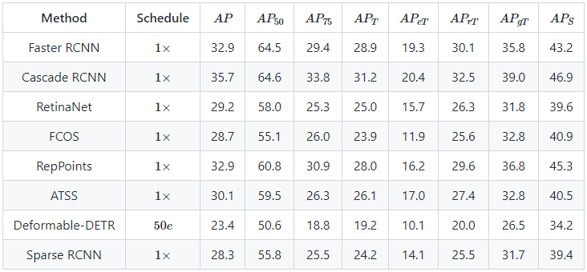
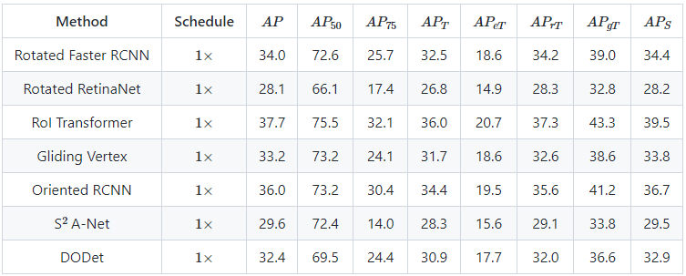

<!--
<head>
<link rel="stylesheet" href="https://cdn.jsdelivr.net/npm/katex@0.10.2/dist/katex.min.css" integrity="sha384-yFRtMMDnQtDRO8rLpMIKrtPCD5jdktao2TV19YiZYWMDkUR5GQZR/NOVTdquEx1j" crossorigin="anonymous">

</head>
-->

# SODA: A Large-scale Benchmark for Small Object Detection
**SODA** is a large-scale benckmark for Small Object Detection, including **SODA-D** and **SODA-A** which concentrate on Driving and Aerial scenarios respectively.

## Update
 - [20220726] Our [Homepage](https://shaunyuan22.github.io/SODA/) for SODA benchmark opens!
 - [20220726] Our paper of SODA dataset is submitted to [*arXiv*](https://arxiv.org).
 - [20220726] SODA Benchmark is officially available, please refer to the **Download** below.
 - [20220726] [Codes](https://github.com/shaunyuan22/SODA) for training and evaluating of SODA-D and SODA-A dataset are released.
 - [20220726] Pretrained models are released, please see the **Download** part.
 
## SODA-D
SODA-D contains 24704 well-chosen and high-quality images under driving scenarios, on which 274496 instances of 9 categories with horizontal bounding boxes were annotated. Some example images are shown below.

## SODA-A
SODA-A comprises 2510 high-resolution images of aerial scenes, which has 780203 instances annotated with oriented rectangle box annotations over 9 classes. An example image of SODA-A is shown next.

## Results
We exhibit the experiment resullts of several representative methods on SODA test-set as follow.
 - SDOA-D
  
    <!--
    | **Method** | **Schedule** | **$AP$** | **$AP_{50}$** | **$AP_{75}$** | **$AP_T$** | **$AP_{eT}$** | **$AP_{rT}$** | **$AP_{gT}$** | **$AP_S$** |
    | :----: | :----: | :----: | :----: | :----: | :----: | :----: | :----: | :----: | :----: |
    | Faster RCNN | $1 \times$ | 32.9 | 64.5 | 29.4 | 28.9 | 19.3 | 30.1 | 35.8 | 43.2 |
    | Cascade RCNN | $1 \times$ |35.7 | 64.6 | 33.8 | 31.2 | 20.4 | 32.5 | 39.0 | 46.9 |
    | RetinaNet | $1 \times$ | 29.2 | 58.0 | 25.3 | 25.0 | 15.7 | 26.3 | 31.8 | 39.6 |
    | FCOS | $1 \times$ | 28.7 | 55.1 | 26.0 | 23.9 | 11.9 | 25.6 | 32.8 | 40.9 |
    | RepPoints | $1 \times$ | 32.9 | 60.8 | 30.9 | 28.0 | 16.2 | 29.6 | 36.8 | 45.3 |
    | ATSS | $1 \times$ | 30.1 | 59.5 | 26.3 | 26.1 | 17.0 | 27.4 | 32.8 | 40.5 |
    | Deformable-DETR | $50e$ | 23.4 | 50.6 | 18.8 | 19.2 | 10.1 | 20.0 | 26.5 | 34.2 |
    | Sparse RCNN | $1 \times$ | 28.3 | 55.8 | 25.5 | 24.2 | 14.1 | 25.5 | 31.7 | 39.4 |
    -->
    
 - SDOA-A
  
    <!--
    | **Method** | **Schedule** | **$AP$** | **$AP_{50}$** | **$AP_{75}$** | **$AP_T$** | **$AP_{eT}$** | **$AP_{rT}$** | **$AP_{gT}$** | **$AP_S$** |
    | :----: | :----: | :----: | :----: | :----: | :----: | :----: | :----: | :----: | :----: |
    | Rotated Faster RCNN| $1 \times$ | 34.0 | 72.6 | 25.7 | 32.5 | 18.6 | 34.2 | 39.0 | 34.4 |
    | Rotated RetinaNet | $1 \times$ | 28.1 | 66.1 | 17.4 | 26.8 | 14.9 | 28.3 | 32.8 | 28.2 |
    | RoI Transformer | $1 \times$ | 37.7 | 75.5 | 32.1 | 36.0 | 20.7 | 37.3 | 43.3 | 39.5 |
    | Gliding Vertex | $1 \times$ | 33.2 | 73.2 | 24.1 | 31.7 | 18.6 | 32.6 | 38.6 | 33.8 |
    | Oriented RCNN | $1 \times$ | 36.0 | 73.2 | 30.4 | 34.4 | 19.5 | 35.6 | 41.2 | 36.7 |
    | S$^2$ A-Net | $1 \times$ | 29.6 | 72.4 | 14.0 | 28.3 | 15.6 | 29.1 | 33.8 | 29.5 |
    | DODet | $1 \times$ | 32.4 | 69.5 | 24.4 | 30.9 | 17.7 | 32.0 | 36.6 | 32.9 |
    -->

## Download
We provide the downloading of our paper, datasets and pretrained models.
 - Paper: [Towards Large-Scale Small Object Detection: Survey and Benchmarks](https://arxiv.org)
 - Datasets:
   - SODA-D: [OneDrvie](https://www.microsoft.com/onedrive); [BaiduNetDisk](https://pan.baidu.com)
   - SODA-A: [OneDrvie](https://www.microsoft.com/onedrive); [BaiduNetDisk](https://pan.baidu.com)
 - Pretrained Models: Models trained on trsin-set are available at: [OneDrvie](https://www.microsoft.com/onedrive); [BaiduNetDisk](https://pan.baidu.com)

## Support or Contact
If you have any problems about our SODA benchmark, please be free to contact us at shaunyuan@mail.nwpu.edu.cn.
